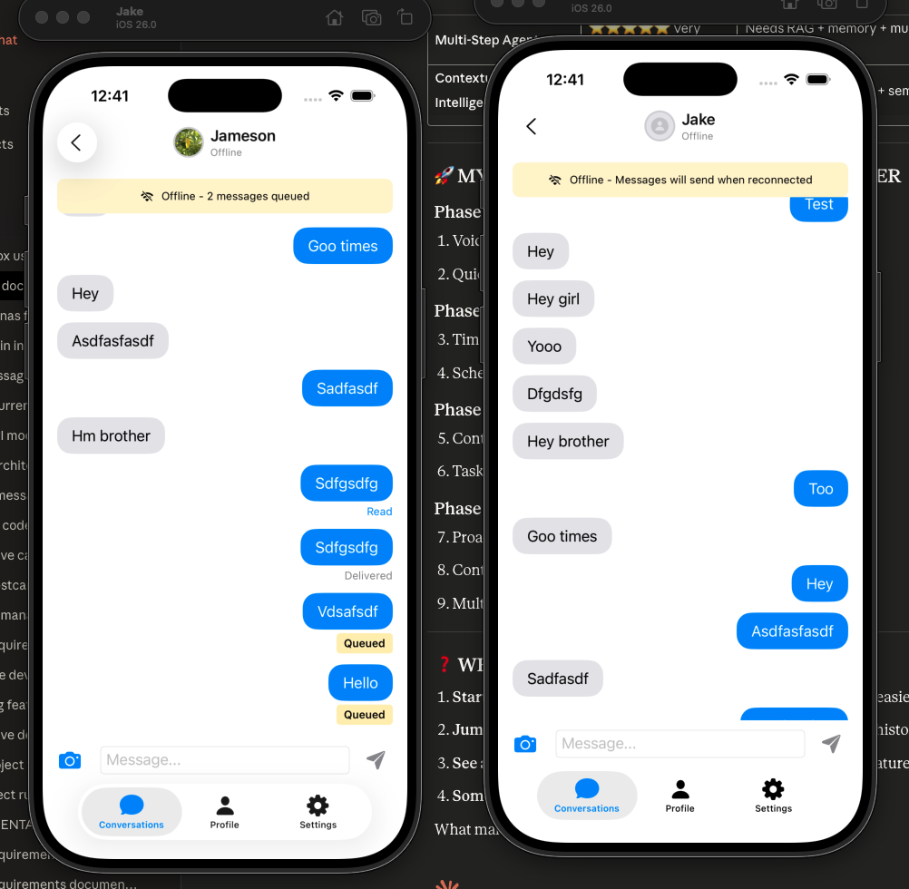

# Product Backlog

## Known Issues

### Message View - Delayed Name/Avatar Loading
**Issue:** In group chat message views, sender names and avatars appear with a delay after the message view loads. Currently shows "..." placeholder while fetching sender names asynchronously.

**Root Cause:** 
- `getSenderName(for:)` method returns "..." placeholder while `fetchSenderName(for:)` runs asynchronously
- Sender names are fetched individually as messages are displayed rather than being prefetched
- No caching mechanism for frequently accessed user profiles

**Impact:** Poor user experience with delayed name/avatar appearance in group chats

**Proposed Solution:**
- Prefetch all sender names when chat view loads
- Implement user profile caching for frequently accessed users
- Show loading states instead of "..." placeholders
- Consider preloading user profiles for group members

---

## Future Enhancements

### Profile Photo Loading Refactor
**Status:** Pending 🔄

**Problem:** Profile photo loading logic is scattered across multiple components with inconsistent caching, error handling, and loading states.

**Proposed Solution:**
- Create centralized `ProfilePhotoManager` service with `@MainActor` for thread safety
- Standardize loading states, error handling, and caching across all components
- Update `ProfilePhotoPreview` and `ProfilePhotoWithPresence` to use centralized manager
- Simplify `UserService` to delegate to `ProfilePhotoManager`
- Add comprehensive unit and UI tests
- Follow SwiftUI best practices with proper thread safety and reactive updates

**Expected Benefits:**
- Centralized profile photo logic in single, well-tested service
- Consistent cache-first strategy across all components
- Better error handling and user feedback
- Improved performance with proper background threading
- Enhanced maintainability with single source of truth
- Comprehensive test coverage for all scenarios

**Files to Create/Modify:**
- `Psst/Psst/Services/ProfilePhotoManager.swift` - Centralized service
- `Psst/PsstTests/ProfilePhotoManagerTests.swift` - Unit tests
- `Psst/PsstUITests/ProfilePhotoManagerUITests.swift` - UI tests
- Update `ProfilePhotoPreview.swift` - Use ProfilePhotoManager
- Update `ProfilePhotoWithPresence.swift` - Use ProfilePhotoManager
- Update `UserService.swift` - Delegate to ProfilePhotoManager

### Threading Violation in Message Sending
**Issue:** Publishing changes from background threads is not allowed; make sure to publish values from the main thread (via operators like receive(on:)) on model updates.

**Root Cause:** 
- `MessageService.sendMessage()` and `MessageService.sendImageMessage()` call optimistic completion handlers from background threads
- These completion handlers update `@Published` properties in ViewModels which must happen on main thread
- Firestore callbacks and async operations run on background threads by default

**Impact:** 
- SwiftUI warnings about threading violations
- Potential UI update issues and crashes
- Poor user experience with inconsistent message status updates

**Reference Image:** 

**Proposed Solution:**
- Wrap all optimistic completion calls in `await MainActor.run { }` 
- Ensure all `@Published` property updates happen on main thread
- Add proper thread safety to all ViewModel updates
- Test offline message queuing scenarios thoroughly

**Files to Modify:**
- `Psst/Psst/Services/MessageService.swift` - Fix completion handler threading
- `Psst/Psst/ViewModels/MessageManagementViewModel.swift` - Ensure main thread updates
- Add comprehensive threading tests

---

*Items to be added as they are identified*
